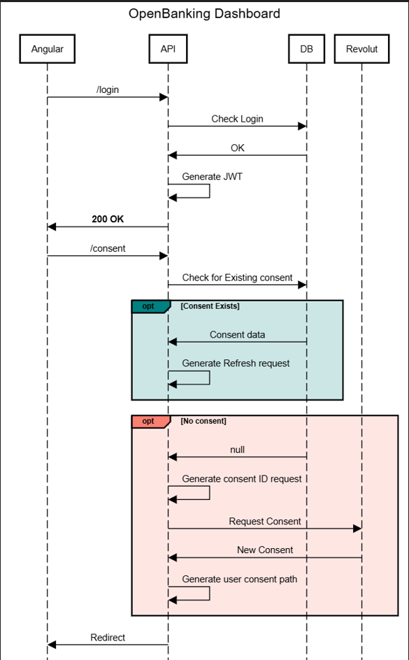

# L00188315_Project

[](https://github.com/Noelg14/L00188315_Project/actions/workflows/provision_infrastructure.yml)
[](https://github.com/Noelg14/L00188315_Project/actions/workflows/dotnet.yml)

[](https://github.com/Noelg14/L00188315_Project/actions/workflows/build.yml)

# About this Project
This Project was done by L00188315.
The application is an Open Banking Dashboard.

### Consent flow:


# Setting up your environment
## Azure Keyvault
Set up a keyvault and an App registration.
Give the app registration access to the Keyvault.

Add value to the `appsettings.json`
```json
  "kvSettings": {
    "ClientId": "<Your ClientID>",
    "ClientSecret": "<your Client Secret>",
    "Scope": "<Scope>",
    "TokenUrl": "https://login.microsoftonline.com/<yourTenant>/oauth2/v2.0/token",
    "KvBaseUrl": "https://<yourvault>.vault.azure.net",
    "KvApiVersion": "7.4"
  }
```
## Generating Eevolut certs:
Follow the below to generate the `private.key` and `transport.pem`.
Create a Developer account with Revolut OpenBanking Dev tools.
Creat an App and note the Client ID

[Preparing the Sandbox Environment ](https://developer.revolut.com/docs/guides/build-banking-apps/get-started/prepare-sandbox-environment)

Combine these using openssl
`openssl pkcs12 -export -in transport.pem -inkey private.key -out combined.pfx`

Lastly, update the `appsettings.json` or the _Environment Variables_ in Azure:
```json
  "Revolut": {
    "baseUrl": "https://sandbox-oba.revolut.com",
    "tokenUrl": "https://sandbox-oba-auth.revolut.com/token",
    "consentUrl": "https://sandbox-oba.revolut.com/account-access-consents",
    "loginUrl": "https://sandbox-oba.revolut.com/ui/index.html?response_type=code%20id_token&scope=accounts",
    "certPath": "<path to PEM file>",
    "keyPath": "<path to private key>",
    "pfxPath": "<path to PFX>",
    "redirectUri": "<refirect url setup on revolut>"
  }
```

## DB & Token Setup
Lastly, set up the database config - below using SQLite
```json
  "database": {
    "type": "sqlite"
  },
  "ConnectionStrings": {
    "DefaultConnection": "Data source=app.db",
    "IdentityConnection": "Data source=app.db"
  },
```
and Add the key for the JWT secret
```json
  "token": {
    "key": "<128 Char token>",
    "issuer": "<issuer name>"
  },
```